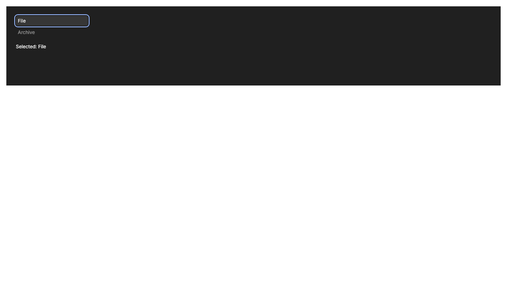

# Frontend candidate verification — 2026-09-08

This is a development receipt, not a publication or security certification. [PR #137](https://github.com/memi-design/memi/pull/137) builds on the Trust Core candidate. npm `latest` was checked and remains **2.7.9**. All 13 public organization repositories were inspected for release claims; none described 2.8 as released. Website changelog freshness and the existing sandbox documentation PR remain separate public-surface work.

## Historical package — superseded for release readiness

Source checkpoint: `2a6d0e449743fc8ca59d9f209d48de56c5d7198b`.

- Package: `@memi-design/cli@2.8.0-beta.1`, locally packed and installed with lifecycle scripts disabled and optional peers omitted.
- Tarball SHA-256: `8e39c853aaaedb097ce26550ac456f299d2ce6ffe46aa56834e877f052468ce5`.
- Compressed: **651,529 bytes**; unpacked: **2,228,617 bytes**; **65 files**.
- Installed production tree: **55,883,130 bytes**; fresh install audited **zero vulnerabilities**.
- Package budgets pass with the existing 10% compressed headroom rule; installed tree stays below 60 MB.

Subsequent workflow, test, harness-reference, and defensive runtime corrections are not part of this tarball. The attachment, renderer, read-only audit, and provider-frame fixes require a new package and replay before release readiness can be assessed. A publication run must rebuild from its approved source and retain the new artifact digest. This locally retained tarball is not an npm or signed offline release.

## Executed checks

| Check | Result and scope |
| --- | --- |
| Full source suite | **3,273 assertions passed across 383 files** after harness-reference correction. |
| Full source coverage | **73.23% statements, 65.97% branches, 80.97% functions, 74.52% lines**. Publication gate fails; denominator is unchanged. [Receipt](evidence/frontend-2.8/coverage-summary.json). |
| Installed CLI matrix | **51/51 passed**: three profiles, read tools, intentional write grants, metadata receipts, rejected paths/links/network requests, and deferred commands. This is CLI/filesystem evidence, not syscall tracing. [Receipt](evidence/frontend-2.8/cli-matrix.json). |
| Installed stdio | Node **22.22.3** and **24.19.0**: initialize, exactly four tools, useful brief/diagnosis, denial, cancellation and clean close; no sentinel side effects. [Node 22](evidence/frontend-2.8/mcp-node22.txt), [Node 24](evidence/frontend-2.8/mcp-node24.txt). |
| Portable Trust Core | Passed against installed bytes on macOS arm64: version **27.1 ms**, locked diagnosis **392 ms**, containment and denial cases. [Receipt](evidence/frontend-2.8/trust-portable.json). |
| Real Storybook | Typecheck, production build and **17/17 Chromium tests** passed, with no skipped or flaky cases. Keyboard, focus, disabled/selected state, themes, and 320/1024 px viewports. [Browser summary](evidence/frontend-2.8/browser-summary.json). |
| Mapping reuse | Figma and Paper envelopes resolve to the same unchanged `SideNavTab`; complete 11-file fixture scan, four story references, no duplicate export. [Receipt](evidence/frontend-2.8/installed-mapping.json). |

These results describe the historical checkpoint only. Later runtime corrections supersede this artifact for release readiness. The next frozen package must repeat installed CLI, MCP, browser, budget, and platform checks; results from the earlier digest cannot certify new bytes.

## What the live tools established

The selected Figma node and its Off-White token were read from the user-selected sandbox. Native Code Connect was unavailable under the current plan, so the association is a checked-in fallback. A separate synthetic Paper file was created and its actual JSX/styles read through Paper 0.5.6's MCP server. Paper screenshot output was black even after a repeated targeted capture: **Paper pixel comparison remains unassessed**.

The component catalog and consumer are synthetic acceptance fixtures. Native button semantics, selected/disabled states, and light theme are authored fixture behavior. CSS/interaction checks are not vendor screenshot pixel-diff certification, complete accessibility conformance, or proof about an arbitrary customer repository. The static brief continues to label rendered verification `unassessed`; the actual browser result is separate evidence.

## Local context performance and cost

Ten fresh installed MCP processes each initialized, listed tools, and produced the first useful brief over **500 files, 20 stories, and 100 tokens**. Median **495.7 ms**, p95 **502.8 ms**, zero failures; every successful brief was **13,600 bytes**. Negative stale/missing mapping checks passed and project/home fingerprints were unchanged. Filesystem caches were not flushed. [Full receipt](evidence/frontend-2.8/frontend-benchmark.json).

The whole eligible source set was **126,406 bytes**. The already-selected component/story/token/evidence subset was **5,664 bytes**. Memi returned less context than the whole repository and more than that narrow subset. No model or paid connector was invoked by this benchmark; **it does not establish complete-task token or dollar savings**. CPU/memory consumption and performance on another machine remain unassessed by this measurement.

## Remaining release gates

1. Raise all four full-source coverage metrics to 80% with meaningful tests; do not shrink the denominator.
2. Complete managed independent security scanning in a supported permission environment. The earlier tool rejection occurred before scanning; ordinary CI scanning and focused Astra review do not replace it.
3. Refresh required parity/DesignWorkBench receipts and all native platform checks on the actual release source. Initial PR CI includes a passing frontend replay and native Linux arm64 containment job; final-head CI must be checked separately.
4. Produce verified public artifacts, signatures/provenance, and clean-install receipts before npm or organization-wide candidate promotion.

105 of 158 legacy CLI action paths remain deliberately unavailable pending their capability audits. The new frontend workflow does not make 2.8 a drop-in replacement for every 2.7 command. See [command support](COMMAND_SUPPORT.json) and [the workflow guide](../FRONTEND_WORKFLOW.md).
