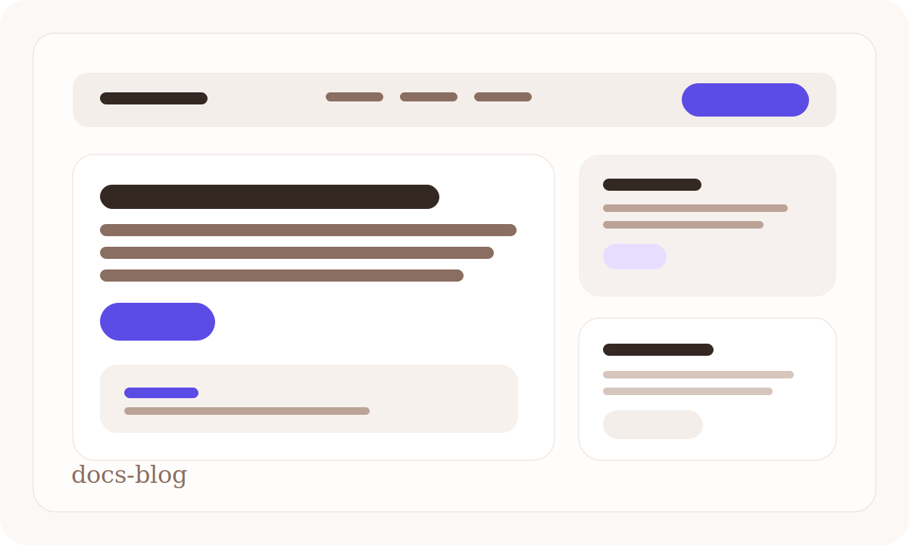

# Memoire Examples

Seed content for the Memoire Marketplace. Every folder under `presets/` is a
ready-to-publish `@memoire-examples/*` registry.

## Featured registries

These are the three first-party packages to put in front of new users first.

<p align="center">
  
  
  
</p>

| Registry | What it is | Install | Source |
|--------|------|------|------|
| [`starter-saas`](./presets/starter-saas) | Neutral SaaS starter with blue product accents and clean app-shell primitives. | `memi add Button --from @memoire-examples/starter-saas` | [`source`](./presets/starter-saas) |
| [`docs-blog`](./presets/docs-blog) | Editorial docs/blog kit with softer surfaces and reading-friendly accents. | `memi add Button --from @memoire-examples/docs-blog` | [`source`](./presets/docs-blog) |
| [`dashboard`](./presets/dashboard) | High-contrast ops dashboard starter for admin and analytics products. | `memi add Button --from @memoire-examples/dashboard` | [`source`](./presets/dashboard) |

Machine-readable fallback data for the website lives in [`featured-registries.json`](./featured-registries.json).

## Presets

| Preset | Name | Vibe |
|--------|------|------|
| [`presets/starter-saas`](./presets/starter-saas) | `@memoire-examples/starter-saas` | Neutral SaaS starter with blue product accents. |
| [`presets/docs-blog`](./presets/docs-blog) | `@memoire-examples/docs-blog` | Editorial docs/blog kit, reading-first surfaces. |
| [`presets/dashboard`](./presets/dashboard) | `@memoire-examples/dashboard` | Dark analytics dashboard with electric contrast. |
| [`presets/starter`](./presets/starter) | `@memoire-examples/starter` | Neutral grayscale + one blue accent. Fork me. |
| [`presets/tweakcn-vercel`](./presets/tweakcn-vercel) | `@memoire-examples/tweakcn-vercel` | Vercel-inspired high-contrast B&W + electric blue, light+dark. |
| [`presets/tweakcn-supabase`](./presets/tweakcn-supabase) | `@memoire-examples/tweakcn-supabase` | Supabase-inspired green on near-black, technical/mono-heavy. |
| [`presets/tweakcn-linear`](./presets/tweakcn-linear) | `@memoire-examples/tweakcn-linear` | Linear-inspired indigo-violet on warm-white, editorial. |

Each preset ships:

- `package.json` with the `@memoire-examples/<slug>` name and `memoire.registry: true`
- `registry.json` valid per Memoire Registry Protocol v1
- `tokens/tokens.json` (W3C DTCG) and `tokens/tokens.css` (Tailwind v4 `@theme`)
- Four components — `Button`, `Card`, `Badge`, `Input` — with JSON specs and real React code
- `Button` has a `loading` prop that swaps the label for an accessible spinner

## Validate

```bash
npm run validate:presets            # all presets
node scripts/build-presets.mjs starter   # a single preset
```

Zod roundtrip + file existence are covered by
`examples/presets/__tests__/schema-roundtrip.test.ts` (runs under `npm test`).

## Fork and ship your own

```bash
cp -r examples/presets/starter my-design-system
cd my-design-system
# edit package.json + registry.json name
npm publish --access public
```

## Legacy

`starter-registry/` is the original bare starter. The presets above are more
developed versions of that pattern.

## Notes on tweakcn-* presets

The tweakcn-flavoured presets are *inspired-by* reimplementations in Memoire's
own token format. No proprietary tweakcn preset JSON is redistributed, so these
are safe to fork and republish under your own scope.
