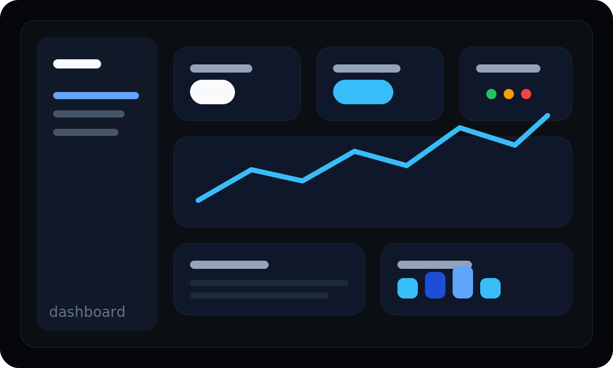

# @memoire-examples/dashboard

<p align="center">
  
</p>

A dashboard starter for analytics, admin, and ops products. High-contrast surfaces, bright status color, and compact component shapes that read well in dense UIs.

**Vibe:** sharp, operational, data-heavy  
**Modes:** light + dark

```
--color-foreground: oklch(98% 0.002 280)
--color-surface:    oklch(8% 0.005 280)
--color-accent:     oklch(70% 0.2 250)  /* electric blue */
```

## Install

```bash
memi add Button --from @memoire-examples/dashboard
```

## Fork and ship your own

```bash
cp -r examples/presets/dashboard my-ds && cd my-ds
# rename in package.json + registry.json
memi publish --name @yourscope/your-ds
npm publish --access public
```

Source: [examples/presets/dashboard](https://github.com/sarveshsea/m-moire/tree/main/examples/presets/dashboard)
